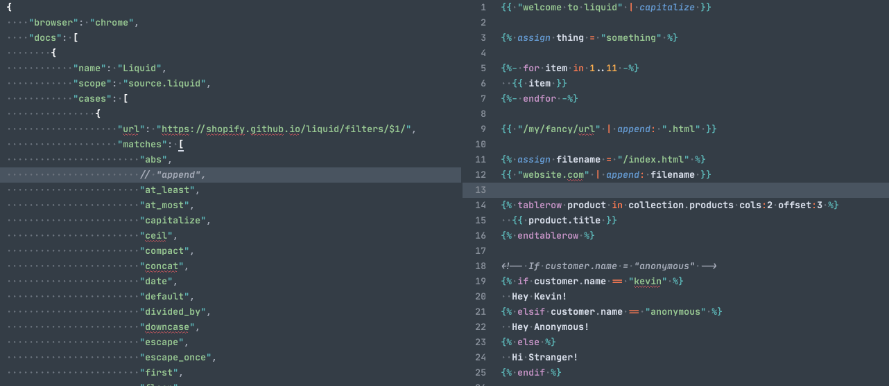

# General Doc

> A plugin for [Sublime Text 3](http://sublimetext.com) that creates documentation from it's own config

## Summary

This packages allows you to list an array of symbols and supply a URL that will be used to point to the documentation for that symbol.

## Installation

With [Package Control](http://wbond.net/sublime_packages/package_control) (look for "General Doc"), or just drop the plugin into Sublime Text's Packages folder.

## Configuration

All configuration is done via the settings file that you can open via the main menu: `Preferences > Package Settings > General Doc > Settings - User`.

### Documentation structure

See [GeneralDoc.sublime-settings](GeneralDoc.sublime-settings) for an example of the structure.

### Built-in documentation

- [x] Liquid (using [shopify.github.io/liquid](https://shopify.github.io/liquid/] or [shopify.dev/docs/liquid](https://shopify.dev/docs/liquid))
- [ ] more examples to come!

### Customising the browser

By default, General Doc uses the default system browser. If it doesn't work for you, you can change the browser by setting the `browser` in the `GeneralDoc.sublime-settings`
file, to which you can get from the menu.

Anything from [this list](https://docs.python.org/2/library/webbrowser.html#webbrowser.register) will work, for example:

    {
        "browser": "firefox"
    }

**Note for Windows users.** If the browser you want won't open, you might have to specify the full path manually:

    {
        "browser": "\"c:\\program files\\mozilla firefox\\firefox.exe\" %s &"
    }

Take note of the escaped slashes and the quoting around the name.

The ampersand at the end is significant - without it the editor will hang and wait for browser to close.

### References

- Packages/Default/symbol.py
- [leonid-shevtsov/ClickableUrls_SublimeText](https://github.com/leonid-shevtsov/ClickableUrls_SublimeText)
